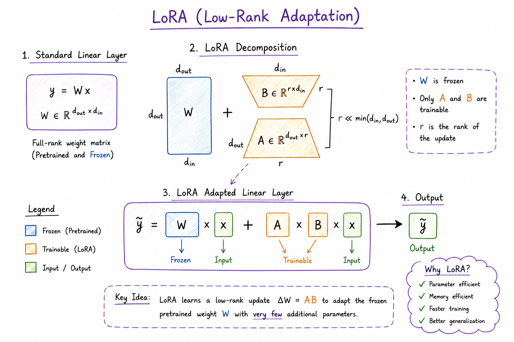
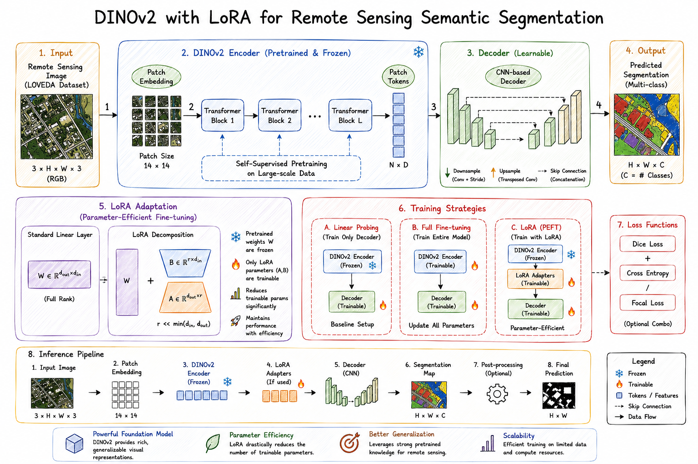

# Parameter-Efficient-Adaptation-of-DINOv2
# DINOv2-LoRA-Remote-Sensing-Segmentation

Parameter-Efficient Adaptation of DINOv2 for Remote Sensing Semantic Segmentation using DINOv2, CNN Decoders, and Low-Rank Adaptation (LoRA).

<p align="center">
  
</p>

<h1 align="center">DINOv2-LoRA Segmentation</h1>

<h3 align="center">
Parameter-Efficient Adaptation of DINOv2 for Remote Sensing Semantic Segmentation
</h3>

<p align="center">
  
  
  
  
  
</p>

---

## Overview

DINOv2-LoRA Segmentation is a remote sensing semantic segmentation framework that leverages pretrained DINOv2 visual representations and parameter-efficient fine-tuning through Low-Rank Adaptation (LoRA).

The project systematically investigates multiple decoder architectures and adaptation strategies, including linear probing, full fine-tuning, and LoRA-based transfer learning for land-cover segmentation on the LOVEDA dataset.

### Framework Components

- DINOv2 Vision Foundation Model
- CNN-Based Decoder
- Decoder Architecture Benchmarking
- Linear Probing
- Full Fine-Tuning
- LoRA Adaptation
- Parameter-Efficient Transfer Learning
- Semantic Segmentation

---

## Dataset

The framework is evaluated on the **LOVEDA Dataset**, a benchmark remote sensing dataset for land-cover semantic segmentation.

Classes include:

- Building
- Road
- Water
- Bare Land
- Agriculture
- Forest
- Background

---

## Proposed Architecture

<p align="center">
  
</p>

The architecture consists of:

1. Remote Sensing Input Image
2. Patch Embedding Generation
3. DINOv2 Feature Extraction
4. LoRA Adaptation
5. CNN Decoder
6. Segmentation Head
7. Pixel-wise Land-Cover Prediction

---

## Training Strategies

### Linear Probing

- Frozen DINOv2 Encoder
- Train Decoder Only

### Full Fine-Tuning

- Train Entire Network
- Update All Parameters

### LoRA (PEFT)

- Freeze DINOv2 Backbone
- Train LoRA Adapters
- Train Decoder Components

---

## Project Structure

```bash
DINOv2-LoRA-Segmentation/
│
├── assets/
│   ├── architecture.png
│   └── workflow.png

├── src/
│
├── train.py
├── test.py
├── inference.py
│
├── requirements.txt
├── README.md
└── .gitignore
```

---

## Technologies Used

- Python
- PyTorch
- DINOv2
- LoRA
- PEFT
- OpenCV
- NumPy
- Matplotlib
- Remote Sensing
- Semantic Segmentation

---

## Key Features

- DINOv2 Foundation Model
- CNN Decoder Integration
- Multi-Decoder Benchmarking
- Linear Probe Training
- Full Fine-Tuning
- LoRA-Based Adaptation
- Parameter-Efficient Learning
- Remote Sensing Segmentation

---

## Why DINOv2 + LoRA?

DINOv2 provides powerful self-supervised visual representations that transfer effectively to downstream dense prediction tasks.

By integrating Low-Rank Adaptation (LoRA), the framework enables efficient fine-tuning with significantly fewer trainable parameters while preserving pretrained knowledge. Combined with a CNN-based decoder, the model effectively performs land-cover semantic segmentation on remote sensing imagery.

---
